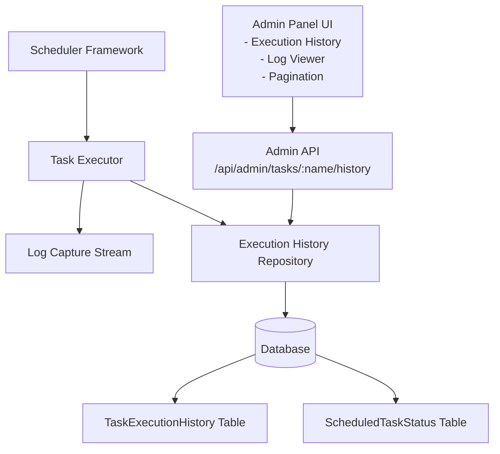
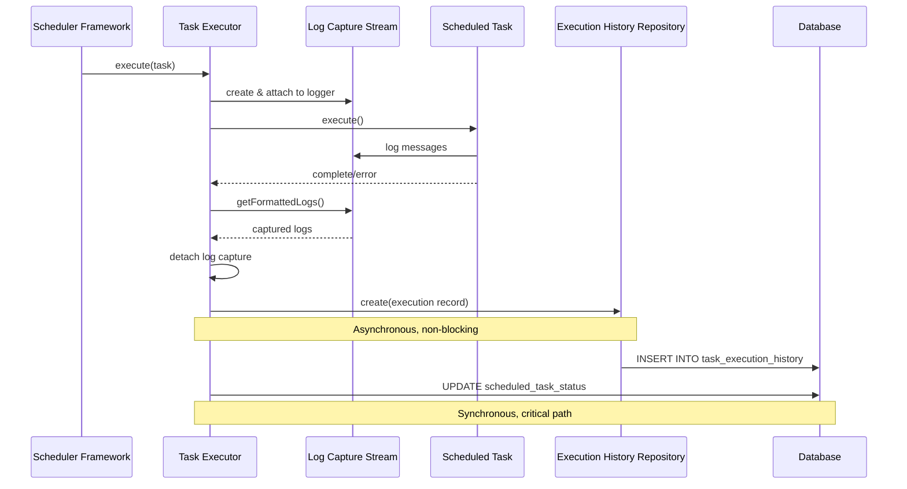
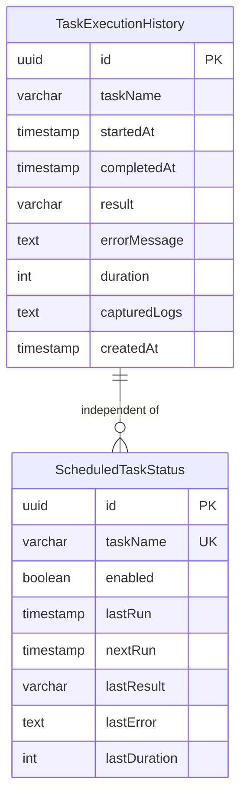

# Design Document: Persistent Task Execution History

## Overview

This design extends the existing task scheduler framework to provide persistent storage of task execution history with detailed log capture. The current implementation only stores the most recent execution in the `ScheduledTaskStatus` table, which is lost on application restart. This enhancement adds a new `TaskExecutionHistory` table to store all executions with captured logs, new API endpoints to query history, and an enhanced admin panel UI to display historical data.

The design maintains backward compatibility with the existing scheduler framework and adds minimal performance overhead through asynchronous history storage and log capture.

## Architecture

### High-Level Architecture



### Component Interaction Flow



## Components and Interfaces

### 1. TaskExecutionHistory Database Model

New Prisma model for storing execution history:

```prisma
model TaskExecutionHistory {
  id          String    @id @default(uuid()) @db.Uuid
  taskName    String    @db.VarChar(100)
  startedAt   DateTime
  completedAt DateTime
  result      String    @db.VarChar(20)  // 'success' | 'failure'
  errorMessage String?  @db.Text
  duration    Int       // milliseconds
  capturedLogs String?  @db.Text
  createdAt   DateTime  @default(now())
  
  @@index([taskName, startedAt(sort: Desc)])
  @@index([startedAt])
  @@map("task_execution_history")
}
```

### 2. ExecutionHistoryRepository

Repository for managing execution history records:

```typescript
interface ExecutionHistoryRecord {
  taskName: string;
  startedAt: Date;
  completedAt: Date;
  result: 'success' | 'failure';
  errorMessage: string | null;
  duration: number;
  capturedLogs: string | null;
}

interface ExecutionHistoryQuery {
  taskName: string;
  limit: number;
  offset: number;
}

class ExecutionHistoryRepository {
  /**
   * Creates a new execution history record
   */
  async create(record: ExecutionHistoryRecord): Promise<void>;
  
  /**
   * Queries execution history with pagination
   */
  async findByTaskName(query: ExecutionHistoryQuery): Promise<ExecutionHistoryRecord[]>;
  
  /**
   * Counts total executions for a task
   */
  async countByTaskName(taskName: string): Promise<number>;
  
  /**
   * Deletes execution records older than the specified date
   * Preserves at least minRecordsToKeep per task
   */
  async deleteOlderThan(
    cutoffDate: Date,
    minRecordsToKeep: number
  ): Promise<number>;
}
```

### 3. LogCaptureStream

Custom Winston transport for capturing logs during task execution:

```typescript
interface CapturedLog {
  timestamp: string;
  level: string;
  message: string;
  metadata?: any;
}

class LogCaptureStream extends Transport {
  private logs: CapturedLog[];
  private maxSize: number; // 100KB limit
  private currentSize: number;
  
  constructor(options: { maxSize?: number });
  
  /**
   * Captures a log entry
   */
  log(info: any, callback: () => void): void;
  
  /**
   * Returns captured logs as formatted string
   */
  getFormattedLogs(): string;
  
  /**
   * Clears captured logs
   */
  clear(): void;
}
```

### 4. Enhanced TaskExecutor

Modified TaskExecutor to capture logs and store history:

```typescript
class TaskExecutor {
  private statusRepository: TaskStatusRepository;
  private historyRepository: ExecutionHistoryRepository;
  private historyEnabled: boolean;
  
  constructor(
    statusRepository: TaskStatusRepository,
    historyRepository: ExecutionHistoryRepository,
    config: { historyEnabled: boolean }
  );
  
  /**
   * Executes task with log capture and history storage
   */
  async execute(task: ScheduledTask): Promise<void> {
    // 1. Create log capture stream
    // 2. Attach to logger
    // 3. Execute task
    // 4. Capture execution details
    // 5. Store in history (async, non-blocking)
    // 6. Update status table
    // 7. Detach log capture stream
  }
}
```

### 5. Admin API Endpoints

New endpoint for querying execution history:

```typescript
/**
 * GET /api/admin/tasks/:name/history
 * 
 * Query parameters:
 * - limit: number (1-100, default 10)
 * - offset: number (default 0)
 * 
 * Response:
 * {
 *   taskName: string;
 *   executions: Array<{
 *     id: string;
 *     startedAt: string;
 *     completedAt: string;
 *     result: 'success' | 'failure';
 *     errorMessage: string | null;
 *     duration: number;
 *     capturedLogs: string | null;
 *   }>;
 *   total: number;
 *   limit: number;
 *   offset: number;
 * }
 */
async function getTaskExecutionHistory(
  req: AuthRequest,
  res: Response,
  next: NextFunction
): Promise<void>;
```

### 6. Admin Panel UI Components

Enhanced ScheduledTasksTab with execution history:

```typescript
interface ExecutionHistoryEntry {
  id: string;
  startedAt: string;
  completedAt: string;
  result: 'success' | 'failure';
  errorMessage: string | null;
  duration: number;
  capturedLogs: string | null;
}

interface ExecutionHistoryModalProps {
  taskName: string;
  isOpen: boolean;
  onClose: () => void;
}

// Components:
// - ExecutionHistoryModal: Displays paginated execution history
// - ExecutionLogViewer: Displays detailed logs for a single execution
// - PaginationControls: Navigate through execution history
```

### 7. Retention Configuration

Configuration for log retention:

```typescript
interface RetentionConfig {
  retentionDays: number;        // Default: 30
  minRecordsPerTask: number;    // Default: 10
  purgeSchedule: string;        // Default: '0 2 * * *' (2 AM daily)
}

// Environment variables:
// - TASK_HISTORY_RETENTION_DAYS
// - TASK_HISTORY_MIN_RECORDS
// - TASK_HISTORY_PURGE_SCHEDULE
```

### 8. History Purge Task

Scheduled task for cleaning up old execution history:

```typescript
const historyPurgeTask: ScheduledTask = {
  name: 'task-history-purge',
  schedule: config.purgeSchedule,
  enabled: true,
  execute: async () => {
    const cutoffDate = new Date();
    cutoffDate.setDate(cutoffDate.getDate() - config.retentionDays);
    
    const deletedCount = await historyRepository.deleteOlderThan(
      cutoffDate,
      config.minRecordsPerTask
    );
    
    logger.info('Task history purge completed', {
      deletedCount,
      cutoffDate: cutoffDate.toISOString(),
    });
  },
};
```

## Data Models

### TaskExecutionHistory Table

| Column | Type | Constraints | Description |
|--------|------|-------------|-------------|
| id | UUID | PRIMARY KEY | Unique execution identifier |
| taskName | VARCHAR(100) | NOT NULL, INDEXED | Name of the executed task |
| startedAt | TIMESTAMP | NOT NULL, INDEXED | Execution start time |
| completedAt | TIMESTAMP | NOT NULL | Execution completion time |
| result | VARCHAR(20) | NOT NULL | 'success' or 'failure' |
| errorMessage | TEXT | NULLABLE | Error message if failed |
| duration | INTEGER | NOT NULL | Execution duration in ms |
| capturedLogs | TEXT | NULLABLE | Captured log output (max 100KB) |
| createdAt | TIMESTAMP | NOT NULL, DEFAULT NOW() | Record creation time |

**Indexes:**
- `idx_task_execution_history_task_started` on (taskName, startedAt DESC) - For efficient history queries
- `idx_task_execution_history_started` on (startedAt) - For purge operations

### Relationship to Existing Tables



- **No foreign key relationship** to ScheduledTaskStatus (independent history)
- TaskExecutionHistory stores historical records
- ScheduledTaskStatus stores current/latest status
- Both tables updated independently during task execution

## Correctness Properties

*A property is a characteristic or behavior that should hold true across all valid executions of a system—essentially, a formal statement about what the system should do. Properties serve as the bridge between human-readable specifications and machine-verifiable correctness guarantees.*


### Property 1: Task execution creates complete history record

*For any* task execution, when the task completes (successfully or with failure), a new TaskExecutionHistory record should be created containing the task name, start time, end time, result status, error message (if failed), and execution duration, AND the ScheduledTaskStatus table should be updated with the latest execution information.

**Validates: Requirements 1.1, 1.2, 1.4**

### Property 2: Execution history ordered by start time

*For any* task with multiple execution records, when querying execution history, the records should be returned ordered by startedAt timestamp in descending order (most recent first).

**Validates: Requirements 1.5**

### Property 3: Log capture includes all levels

*For any* task execution that logs messages at different levels (debug, info, warn, error), all logged messages should be captured and stored in the capturedLogs field of the TaskExecutionHistory record.

**Validates: Requirements 2.1, 2.2, 2.3**

### Property 4: API returns paginated history with complete data

*For any* task with execution history, when querying the history API with limit and offset parameters, the response should return the correct number of records (respecting the limit), skip the correct number of records (respecting the offset), and each record should include all required fields (taskName, startedAt, completedAt, result, errorMessage, duration, capturedLogs).

**Validates: Requirements 3.1, 3.2, 3.3, 3.5**

### Property 5: Purge deletes old records beyond retention period

*For any* set of execution records with various timestamps, when the purge task runs with a configured retention period, all records with startedAt older than (current date - retention period) should be deleted, except those protected by the minimum retention rule.

**Validates: Requirements 6.3**

### Property 6: Purge preserves minimum records per task

*For any* task with execution records older than the retention period, when the purge task runs, at least the most recent 10 execution records for that task should be preserved regardless of their age.

**Validates: Requirements 6.4**

### Property 7: Log size limited to maximum

*For any* task execution that generates log output, the captured logs stored in the TaskExecutionHistory record should not exceed 100KB in size, with excess content truncated.

**Validates: Requirements 7.5**

## Error Handling

### Log Capture Failures

- If log capture stream initialization fails, task execution continues without log capture
- Log capture failure is logged to the main application log
- TaskExecutionHistory record is created with capturedLogs set to null
- Error message indicates log capture was unavailable

### History Storage Failures

- History storage operations are wrapped in try-catch blocks
- Storage failures are logged but do not propagate to task execution
- Task execution completes successfully even if history storage fails
- ScheduledTaskStatus table is always updated (critical path)
- TaskExecutionHistory storage is best-effort (non-critical path)

### Database Connection Issues

- If database is unavailable during history storage, operation fails gracefully
- Retry logic is not implemented (fire-and-forget approach)
- Application continues normal operation
- Monitoring/alerting should detect missing history records

### API Error Responses

| Scenario | Status Code | Response |
|----------|-------------|----------|
| Invalid limit parameter | 400 | `{ error: "limit must be between 1 and 100" }` |
| Invalid offset parameter | 400 | `{ error: "offset must be non-negative" }` |
| Task not found | 200 | `{ executions: [], total: 0 }` |
| Database error | 500 | `{ error: "Failed to retrieve execution history" }` |
| Unauthorized | 401 | `{ error: "Authentication required" }` |

### Log Size Overflow

- Log capture stream monitors cumulative log size
- When approaching 100KB limit, stream stops capturing new logs
- Truncation message appended: `\n[LOG TRUNCATED: Maximum size exceeded]`
- Execution continues normally
- Full logs still available in application log files

## Testing Strategy

### Dual Testing Approach

This feature requires both unit tests and property-based tests for comprehensive coverage:

**Unit Tests** focus on:
- Specific examples of execution history creation
- Edge cases (empty logs, null error messages, zero duration)
- Error conditions (storage failures, log capture failures)
- API endpoint response formats
- Configuration loading and validation
- Integration between components

**Property-Based Tests** focus on:
- Universal properties across all task executions
- Pagination correctness with various limit/offset combinations
- Log capture across different log levels and volumes
- Purge logic with various retention periods and record counts
- Data completeness and ordering guarantees

### Property-Based Testing Configuration

- **Library**: fast-check (TypeScript property-based testing library)
- **Minimum iterations**: 100 per property test
- **Test tagging**: Each property test must reference its design property
- **Tag format**: `// Feature: persistent-task-execution-history, Property N: [property text]`

### Test Coverage Requirements

**Backend Tests** (`src/scheduler/`):
- ExecutionHistoryRepository: CRUD operations, pagination, purge logic
- LogCaptureStream: Log capture, size limiting, formatting
- Enhanced TaskExecutor: History storage, log capture integration
- Purge task: Retention logic, minimum record preservation

**API Tests** (`src/controllers/admin.ts`):
- GET /api/admin/tasks/:name/history endpoint
- Parameter validation (limit, offset)
- Response format and data completeness
- Error handling and status codes

**Frontend Tests** (`frontend/src/components/`):
- ExecutionHistoryModal: Rendering, pagination
- ExecutionLogViewer: Log display, copy functionality
- Integration with existing ScheduledTasksTab

### Example Unit Tests

```typescript
describe('ExecutionHistoryRepository', () => {
  it('should create execution history record with all fields', async () => {
    const record = {
      taskName: 'test-task',
      startedAt: new Date('2024-01-01T10:00:00Z'),
      completedAt: new Date('2024-01-01T10:00:05Z'),
      result: 'success' as const,
      errorMessage: null,
      duration: 5000,
      capturedLogs: 'Test log output',
    };
    
    await repository.create(record);
    
    const history = await repository.findByTaskName({
      taskName: 'test-task',
      limit: 10,
      offset: 0,
    });
    
    expect(history).toHaveLength(1);
    expect(history[0]).toMatchObject(record);
  });
  
  it('should handle empty logs gracefully', async () => {
    const record = {
      taskName: 'test-task',
      startedAt: new Date(),
      completedAt: new Date(),
      result: 'success' as const,
      errorMessage: null,
      duration: 100,
      capturedLogs: null,
    };
    
    await repository.create(record);
    
    const history = await repository.findByTaskName({
      taskName: 'test-task',
      limit: 10,
      offset: 0,
    });
    
    expect(history[0].capturedLogs).toBeNull();
  });
});
```

### Example Property-Based Tests

```typescript
import * as fc from 'fast-check';

describe('ExecutionHistoryRepository - Property Tests', () => {
  // Feature: persistent-task-execution-history, Property 2: Execution history ordered by start time
  it('should return execution history ordered by startedAt descending', async () => {
    await fc.assert(
      fc.asyncProperty(
        fc.array(fc.date(), { minLength: 2, maxLength: 20 }),
        async (dates) => {
          const taskName = `test-task-${Date.now()}`;
          
          // Create execution records with random dates
          for (const date of dates) {
            await repository.create({
              taskName,
              startedAt: date,
              completedAt: new Date(date.getTime() + 1000),
              result: 'success',
              errorMessage: null,
              duration: 1000,
              capturedLogs: 'test',
            });
          }
          
          // Query history
          const history = await repository.findByTaskName({
            taskName,
            limit: 100,
            offset: 0,
          });
          
          // Verify descending order
          for (let i = 0; i < history.length - 1; i++) {
            expect(history[i].startedAt.getTime())
              .toBeGreaterThanOrEqual(history[i + 1].startedAt.getTime());
          }
        }
      ),
      { numRuns: 100 }
    );
  });
  
  // Feature: persistent-task-execution-history, Property 4: API returns paginated history with complete data
  it('should respect limit and offset parameters', async () => {
    await fc.assert(
      fc.asyncProperty(
        fc.integer({ min: 10, max: 50 }),
        fc.integer({ min: 1, max: 10 }),
        fc.integer({ min: 0, max: 5 }),
        async (totalRecords, limit, offset) => {
          const taskName = `test-task-${Date.now()}`;
          
          // Create multiple execution records
          for (let i = 0; i < totalRecords; i++) {
            await repository.create({
              taskName,
              startedAt: new Date(Date.now() + i * 1000),
              completedAt: new Date(Date.now() + i * 1000 + 500),
              result: 'success',
              errorMessage: null,
              duration: 500,
              capturedLogs: `Log ${i}`,
            });
          }
          
          // Query with pagination
          const history = await repository.findByTaskName({
            taskName,
            limit,
            offset,
          });
          
          // Verify correct number of records returned
          const expectedCount = Math.min(limit, Math.max(0, totalRecords - offset));
          expect(history).toHaveLength(expectedCount);
          
          // Verify all required fields present
          history.forEach(record => {
            expect(record).toHaveProperty('taskName');
            expect(record).toHaveProperty('startedAt');
            expect(record).toHaveProperty('completedAt');
            expect(record).toHaveProperty('result');
            expect(record).toHaveProperty('duration');
          });
        }
      ),
      { numRuns: 100 }
    );
  });
});
```

## Implementation Notes

### Performance Considerations

1. **Asynchronous History Storage**: History storage must not block task execution
   - Use `Promise.resolve().then()` or `setImmediate()` to defer storage
   - Errors in history storage should not propagate to task execution

2. **Database Indexes**: Critical for query performance
   - Composite index on (taskName, startedAt DESC) for history queries
   - Index on startedAt for purge operations

3. **Log Size Limiting**: Prevent memory and storage issues
   - Monitor log size during capture
   - Truncate at 100KB with clear indication
   - Consider compression for large logs (future enhancement)

4. **Batch Purge Operations**: Efficient deletion of old records
   - Use batch DELETE with LIMIT to avoid long-running transactions
   - Process purge in chunks (e.g., 1000 records at a time)

### Migration Strategy

1. **Database Migration**: Add TaskExecutionHistory table
2. **Feature Flag**: Environment variable to enable/disable history (default: enabled)
3. **Gradual Rollout**: Monitor performance impact in production
4. **Backward Compatibility**: Existing functionality continues unchanged

### Configuration

Environment variables for feature configuration:

```bash
# Enable/disable execution history (default: true)
TASK_HISTORY_ENABLED=true

# Retention period in days (default: 30)
TASK_HISTORY_RETENTION_DAYS=30

# Minimum records to keep per task (default: 10)
TASK_HISTORY_MIN_RECORDS=10

# Purge schedule cron expression (default: 2 AM daily)
TASK_HISTORY_PURGE_SCHEDULE="0 2 * * *"

# Maximum log size in bytes (default: 102400 = 100KB)
TASK_HISTORY_MAX_LOG_SIZE=102400
```

### Monitoring and Observability

Key metrics to monitor:

- **History Storage Success Rate**: Percentage of successful history writes
- **History Storage Latency**: Time taken to store history records
- **Purge Execution Time**: Duration of purge task execution
- **Purge Deletion Count**: Number of records deleted per purge run
- **Log Truncation Rate**: Percentage of executions with truncated logs
- **Database Table Size**: Growth rate of TaskExecutionHistory table

Alerts to configure:

- History storage failure rate > 5%
- Purge task execution failure
- Database table size exceeds threshold
- Log truncation rate > 10%
